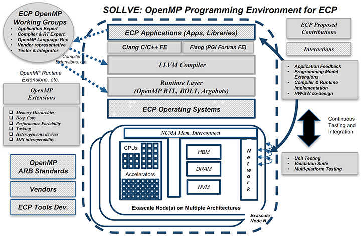

# SOLLVE: Scaling OpenMP With LLVm for Exascale Performance and Portability

SOLLVE is the OpenMP Sub-project in United States Department of Energy's Exascale Computing Project. SOLLVE holds hackathons each year to help application programmers use OpenMP effectively in their application programs.

## Project Description

OpenMP, the de facto directive-based standard for on-node programming provides a convenient and flexible mechanism to exploit the substantial compute power within the nodes of today’s leadership class facilities. Most ECP application proposals include OpenMP as part of their strategy for reaching exascale levels of performance. The applications teams have identified gaps in OpenMP functionality that must be addressed if it is to meet their exascale development needs, including portable data layout abstractions, movement of complex data structures to/from accelerator memories (deep copy), their use in conjunction with the latest C++ standards, tasks and the ability to create performance portable code. In addition, exascale computer hardware will exhibit a dramatic increase in the amount and complexity of intranode threading with greater heterogeneity and more complex hierarchical memory subsystems. We must adapt the OpenMP feature set and its implementation accordingly.

In the SOLLVE project, we will enhance OpenMP to cover the major requirements of ECP application codes. In addtion, this project will deliver a high-quality, robust implementation of OpenMP and project extensions in LLVM, an open source compiler infrastructure with an active developer community that impacts the DOE pre-exascale systems (CORAL). It will further develop the LLVM BOLT runtime system to exploit light-weight threading for scalability and facilitate interoperability with MPI. We propose to help drive work toward a common solution for lightweight threading/tasking support in the ECP software stack. Based upon OpenMP needs and project experiences. We also propose to create a validation suite to assess our progress and that of vendors to ensure that quality implementations of OpenMP are being delivered to Exascale systems. The project will also encourage the accelerated development of similarly high-quality, complete vendor implementations and facilitate extensive interactions between the applications developers and OpenMP developers in

## Interaction with ECP Application Projects

SOLLVE proposes an application-driven approach that requires us to interact extensively with ECP applications, to systematically obtain their input and feedback and ensure that we respond effectively to their needs. We will engage the key vendors, relevant ECP co-design centers and ST teams, and the broader OpenMP community as broadly as possible in order to obtain the best-possible solutions to ECP applications problems, to secure their adoption in new versions of the standard, and to address scalability requirements in the implementation. We will interact with ST teams to develop common solutions to system-wide problems, facilitate integration of our results into the ECP software stack, and help develop the OpenMP requirements needed for the procurement of future Exascale systems. The project’s work on extensions to the OpenMP specification will shape future versions (the near one being OpenMP 5.0). SOLLVE meets ECP’s critical OpenMP requirements.

##  Useful Links

 * [Brookhaven National Laboratory's SOLLVE Page](https://www.bnl.gov/compsci/projects/SOLLVE/)
 * [Oak Ridge National Laboratory's SOLLVE Page](https://openmp-ecp.ornl.gov/)
 * [SOLLVE GitHub Repositorties](https://github.com/sollve)
 * [SOLLVE Hackathons](https://sites.google.com/view/ecp-omp-hack)
 * [SOLLVE Redmine](https://openmp-ecp.ornl.gov/redmine) (restricted)
 
 * [Exascale Computing Project](https://www.exascaleproject.org/)
   * [SOLLVE Project description](https://www.exascaleproject.org/wp-content/uploads/2020/02/ECP_ST_SOLLVE.pdf)
 * [ECP GitHub Repositories for LLVM](https://github.com/llvm-doe-org)
 * [SOLLVE at ECP Confluence](https://confluence.exascaleproject.org/display/STPM15) (restricted)
 * [SOLLVE at ECP Jira](https://jira.exascaleproject.org/projects/STPM15) (restricted)
 
 * [Offical OpenMP Website](https://www.openmp.org/)
 * [OpenMP GitHub Repositories](https://github.com/openmp)
 * [OpenMP TWiki](https://twiki.openmp.org/bin/view/OpenMPLang/WebHome) (restricted)
